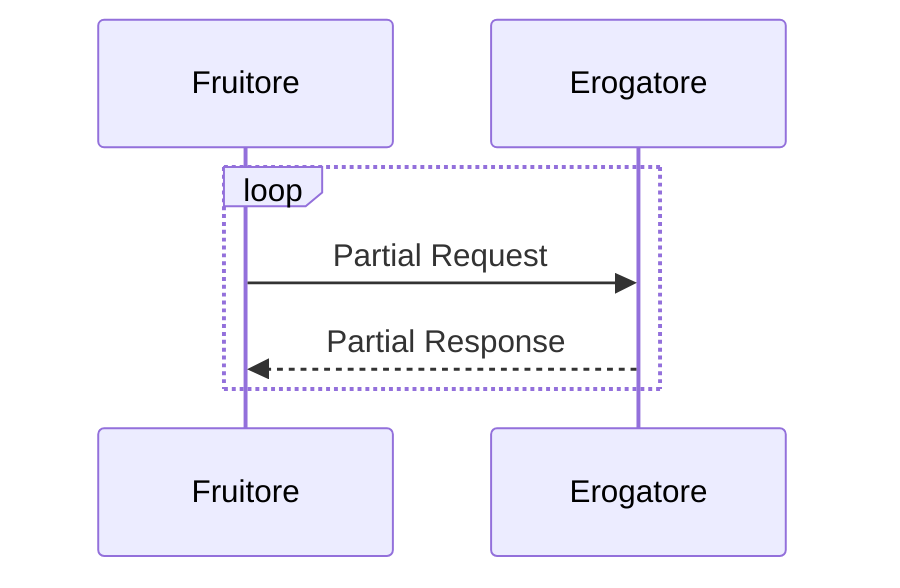

**state**: inWorking

Aggiunta al Documento Operativo "Pattern di Interazione"

# Capitolo 7 - Richiesta Risorse Massive

Lo sviluppo di una interfaccia per la richiesta di risorse massive è auspicabile nei casi in cui:
- Il numero di risorse richieste è elevato le stesse possono essere aggregate in un'unica risposta.
- Ad una richiesta corrisponde una risposta di dimensioni considerevoli. 
- Il contesto rende poco stabile il canale di comunicazione e si vuole fornire flessibilità al fruitore nella gestione delle fluttuazioni dello stesso.

L’erogatore DOVREBBE  adottare interfacce per la richiesta di risorse massive sulla base di proprie valutazioni dei criteri sopra indicati con l’obiettivo di rendere più efficace ed efficiente il recupero della stesse ai fruitori.


In questo pattern l’erogatore rende disponibile ai fruitori la possibilità di realizzare richieste parziali di un risorsa per recuperare una porzione della stessa.

Il sequence diagram descrive un loop di request/response  in cui il fruitore richiede porzioni di risorse e l’erogatore risponde con delle risposte parziali relative della risorsa richiesta.

La richiesta DEVE :
- Corrispondere ad una operazione di Read sulla risorsa richiesta.
- Contenere un percorso che indica un identificativo di risorsa oppure di una collezione di risorse.

### 7.1	[BULK_RESOURCE_REST] Richiesta Risorse Massive REST

L’implementazione in tecnologia REST utilizza la specifica Range Request definita nell’RFC 9110.

La specifica dell’interfaccia DEVE dichiarare tutti i codici di stato HTTP previsti dall’interfaccia, con il relativo schema della risposta, oltre che ad eventuali header HTTP restituiti.

Il pattern è indipendente dalla representation della risorsa restituita, in quanto le richieste sono di tipo byte-range, ovvero la Range Unit è pari a “bytes”.

Il pattern ammette l’utilizzo dei seguenti Range Specifier:
- int-range
- suffix-range
così come indicato  in 14.1.2. Byte Ranges dell’ RFC 9110.

L’erogatore DEVE restituire l’header Accept-Range pari a “bytes” ad un richiesta per la risorsa con metodo HEAD.

L’erogatore DEVE rispondere ad un richiesta parziale con lo status code 206 Partial Content assicurando il popolamento dell’header Content-Range pari all’intervallo parziale della risorsa restituita e dell’header Content-Length pari alla numero di octets della risposta.

L’erogatore DEVE rispondere ad un richiesta del fruitore di un range della risorsa errato lo status code 416 Range Not Satisfiable assicurando il popolamento dell’header Content-Range pari alla lunghezza corrente della risorsa richiesta.

L’erogatore DEVE rispondere ad un richiesta totale della risorsa con lo status code 200 OK.

Il fruitore per effettuare una richiesta parziale DEVE assicurare il popolamento dell’header Range pari alla porzione della risorsa richiesta.

#### 7.1.1	Regole di processamento

Al termine del processamento della richiesta, l’erogatore DEVE fare uso dei codici di stato HTTP rispettando la semantica. In particolare, al ricevimento della richiesta da parte del fruitore, l’erogatore:

- DEVE verificare la validità sintattica e semantica dei dati in ingresso;
- DEVE, in caso di dati errati, restituire HTTP status 400 Bad Request fornendo nel body di risposta dettagli circa l’errore;
- DOVREBBE, in caso di rappresentazione semanticamente non corretta, ritornare HTTP status 422 Unprocessable Entity;
- DOVREBBE, se qualcuno degli ID nel path, restituire HTTP status 404 Not Found, indicando nel body di risposta quale degli ID è mancante;
- PUÒ, se ipotizza che la richiesta sia malevola, ritornare HTTP status 400 Bad Request o HTTP status 404 Not Found
- DEVE, in caso di errori non dipendenti dalla richiesta, restituire HTTP status 5xx rispettando la semantica degli stessi;
- DEVE, rifiutare richieste con Range Specifier non valido nell’header Range della richiesta, e ritornare HTTP status 416 Range Not Satisfiable;
- DEVE, restituire l’intera risorsa richiesta nel caso in cui il fruitore non popoli l’header Range, ritornare HTTP status 200;
- DEVE, in caso di successo, restituire HTTP status 206 Partial Content inviando la porzione, o le porzioni in casi di richiesta di porzioni multiple, di representation della risorsa richiesta corrispondenti al/ai range indicati nella richiesta nel payload body;
- DOVREBBE, restituire l’header Accept-Range pari a “bytes” ad un richiesta per la risorsa con metodo HEAD.

NB: I messaggi di errore devono essere utili al client ma NON DEVONO rivelare dettagli tecnici e/o informazioni riservate.

#### 7.1.2	Esempio

Specifica Servizio 
https://api.ente.example/rest/range-req/v1/RESTRangeRequest.yaml

```yaml
openapi: 3.0.1
info:
  title: Richieste Massive REST
  version: "1.0"
  description: |-
    Questo file descrive semplicemente un'API di esempio 
    e non è da cosiderare esaustivo di tutte le informazioni 
           di metadatazione eventualmente richieste
  license:
    name: Apache 2.0 License
    url: http://www.apache.org/licenses/LICENSE-2.0.html
paths:
  /resource/{id_res}:
    head:
      description: Check supporto Range Reqeest
      responses:
        '200':
          description: Range Request supportate.
          headers:
            Accept-Ranges:
              description: Range unit supportata
              schema:
                type: string
                enum:
                  - bytes
                example: bytes
              
        '400':
           $ref: '#/components/responses/400BadRequest'
        '404':
           $ref: '#/components/responses/404NotFound'
        default:
           $ref: '#/components/responses/default'    
    get:
      description: Recupero risorsa parziale 
      responses:
        "206":
          $ref: '#/components/responses/206PartialContent'  
        '400':
           $ref: '#/components/responses/400BadRequest'
        '404':
           $ref: '#/components/responses/404NotFound'
        "416":
           $ref: "#/components/responses/416RangeNotSatisfaible"

        default:
          $ref: '#/components/responses/default'


    parameters:
      - name: id_res
        in: path
        required: true
        schema:
          type: integer
          format: int32
  
components:
  responses:
    206PartialContent:
      description: porzione di risorsa richiesta
      headers:
          Content-Range:
              description: espressione del range incluso nella risposta
              schema:
                  type: string
                  example: bytes 21010-47021/47022
    400BadRequest:
      description: Richiesta non accoglibile
      content:
        application/json:
          schema:
            $ref: '#/components/schemas/ErrorMessage'
    404NotFound:
      description: Identificativo non trovato
      content:
        application/json:
          schema:
            $ref: '#/components/schemas/ErrorMessage'
    
    416RangeNotSatisfaible:
        description: richiesta di range non soddisfacibile
        headers:
            Content-Range:
                description: lunghezza della representation richiesta
                schema:
                    type: string
                    example: bytes */47022
  
    default:
      description: |-
        Errore inatteso. Questo viene ritornato nel caso ci sia
        un errore inatteso. Non vanno mai esposti i dati interni
        del server.
      content:
        application/json:
          schema:
            $ref: '#/components/schemas/ErrorMessage'
  schemas:
    ErrorMessage:
      type: object
      properties:
        detail:
          description: |
            Una spiegazione human-readable specifica per questa occorrenza del problema.
          type: string
        instance:
          description: |
            Un URI assoluto identificativo della specifica occorrenza del problema.
            Può o non può fornire ulteriori informazioni se dereferenziato.
          format: uri
          type: string
        status:
          description: |
            Il codice di stato HTTP generato dal server di origine per questa occorrenza
            del problema
          format: int32
          maximum: 600
          minimum: 100
          type: integer
        title:
          description: |
            Un breve riepilogo del tipo di problema. Scritto in inglese e leggibile
            per ingegneri (di solito non adatto a parti interessate non tecniche e
            non localizzato); esempio: Servizio non disponibile
          type: string
        type:
          default: about:blank
          description: |
            Un URI assoluto che identifica il tipo di problema. Quando dereferenziato,
            DOVREBBE fornire una documentazione human-readable per il tipo di problema
            (ad esempio, utilizzando HTML).
          format: uri
          type: string
```
Di seguito un esempio di chiamata per la verifica del supporto alle range request

1. Request
```http
HEAD /rest/range-req/v1/municipio/{id_res} HTTP/1.1
Host: api.ente.example
```
2. Response
```http
HTTP/1.1 200 OK
Content-Type: text/plain
Content-Length: 25000
Accept-Ranges: bytes
```

Di seguito un esempio di chiamata per il recupero parziale della risorsa

1. Request

```http
GET /rest/range-req/v1/municipio/{id_res} HTTP/1.1
Host: api.ente.example
Range: bytes=0-999
```
2. Response HTTP status 206 Partial Content

```http
HTTP/1.1 206 Partial Content
Content-Type: text/plain
Content-Length: 1000
Content-Range: bytes 0-999/25000

<1000 bytes of data are included in the message body>
```
2. Response HTTP status 400 Bad Request

```http
HTTP/1.1 400 Bad Request
Content-Type: application/problem+json

{
    "type": "https://apidoc.ente.example/probs/invalid-a",
    "status": 400,
    "title": "L'attributo \`b\` ha un valore non valido.",
    "detail": "L'attributo \`b\` dev'essere una stringa di lunghezza   inferiore a 32 caratteri."
}
```

2. Response HTTP status 404 Not Found

```http
HTTP/1.1 404 Not Found
Content-Type: application/problem+json

{
    "status": 404,
    "title": "Risorsa non trovata."
}
```


